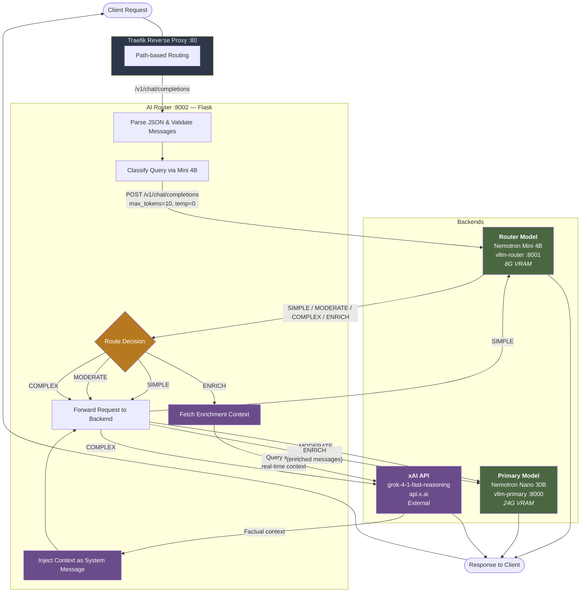
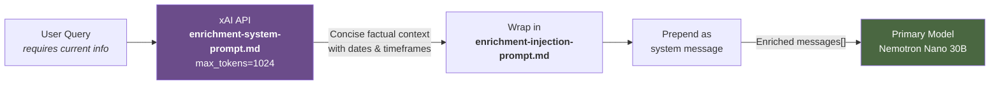
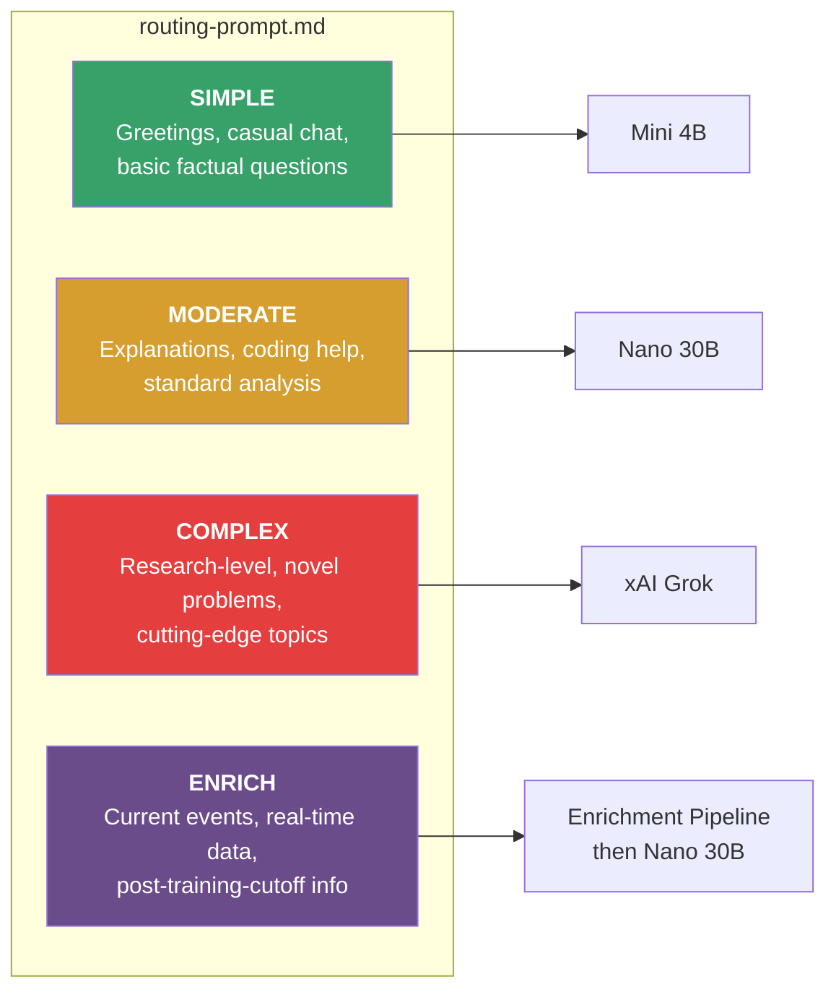
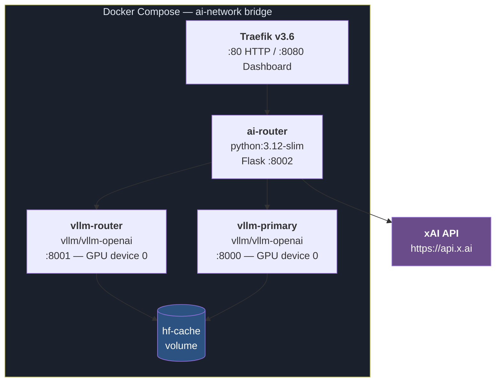

# AI Router - Architecture Diagram

## System Overview

Three-tier intelligent routing system that classifies queries by complexity and routes them to the optimal AI model, with an enrichment pipeline for real-time information.

## Pipeline Diagram

## Enrichment Pipeline Detail

## Routing Classification

## Deployment Topology

## API Endpoints

| Endpoint | Method | Description |
|----------|--------|-------------|
| `/` | GET | Root — API info |
| `/health` | GET | Aggregated health check (router + primary + optional xAI) |
| `/v1/chat/completions` | POST | Main chat endpoint with auto-routing |
| `/v1/completions` | POST | Legacy completions passthrough |
| `/v1/models` | GET | List models from all backends |
| `/api/route` | POST | Explicit routing control for testing |
| `/stats` | GET | Routing statistics |
